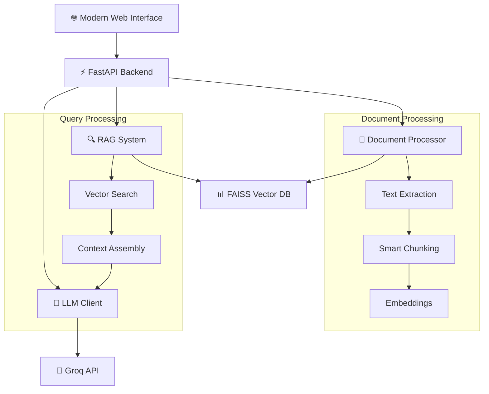

# 🧠 AI Knowledge Hub - Intelligent Document Search Engine

<div align="center">

[](https://python.org)
[](https://fastapi.tiangolo.com)
[](LICENSE)
[](#)

*Transform your documents into an intelligent, searchable knowledge base with AI-powered question answering*

[🚀 Quick Start](#-quick-start) • [📖 Documentation](#-api-documentation) • [🎯 Features](#-features) • [🏗️ Architecture](#-architecture)

</div>

---

## 🌟 Overview

The **AI Knowledge Hub** is a cutting-edge RAG (Retrieval-Augmented Generation) system that transforms your document collection into an intelligent, searchable knowledge base. Upload documents in multiple formats and ask natural language questions to receive AI-synthesized answers with precise source attribution.

## ✨ Features

### 🔥 Core Capabilities
- 📄 **Multi-Format Support** - Upload PDF, DOCX, and TXT files seamlessly
- 🔍 **Intelligent Search** - Advanced vector-based similarity search using state-of-the-art embeddings
- 🤖 **AI-Powered Answers** - Get contextual responses powered by Groq's Llama 4 Scout model
- 📚 **Source Attribution** - Every answer includes precise document references
- ⚡ **Real-time Processing** - Lightning-fast document ingestion and query processing

### 🎨 Modern Interface
- 🌟 **Beautiful UI** - Stunning, responsive design with modern animations
- 🌙 **Dark/Light Mode** - Seamless theme switching for optimal viewing
- 📱 **Mobile Responsive** - Perfect experience across all devices
- 🎯 **Intuitive UX** - Drag-and-drop uploads and smart search interface
- 📊 **Analytics Dashboard** - Real-time statistics and performance metrics

## 🏗️ Architecture



### 🔧 Technology Stack
- **Frontend**: Modern HTML5, CSS3, JavaScript with Tailwind CSS
- **Backend**: FastAPI (Python) with async support
- **AI/ML**: Sentence Transformers, FAISS, Groq LLM API
- **Database**: FAISS vector database with persistent storage
- **Deployment**: Uvicorn ASGI server

## 📋 Prerequisites

- 🐍 **Python 3.8+** (Recommended: Python 3.9 or higher)
- 📦 **pip** (Python package manager)
- 💾 **4GB+ RAM** (For optimal performance with embeddings)
- 🌐 **Internet Connection** (For initial model downloads and LLM API)

## 🚀 Quick Start

### 1️⃣ Clone the Repository
```bash
git clone https://github.com/RajkumarDake/Knowledge-base-Search-Engine.git
cd Knowledge-base-Search-Engine
```

### 2️⃣ Install Dependencies
```bash
# Create virtual environment (recommended)
python -m venv venv
source venv/bin/activate  # On Windows: venv\Scripts\activate

# Install requirements
pip install -r requirements.txt
```

### 3️⃣ Configuration (Optional)
```bash
# Copy environment template
cp .env.example .env

# Edit .env file with your preferences
# Note: Groq API key is pre-configured for demo purposes
```

### 4️⃣ Launch the Application
```bash
# Option 1: Using the start script (recommended)
python start.py

# Option 2: Direct FastAPI launch
python main.py

# Option 3: Production mode
uvicorn main:app --host 0.0.0.0 --port 8000 --reload
```

### 5️⃣ Access the Interface
- 🌐 **Web Interface**: [http://localhost:8000](http://localhost:8000)
- 📚 **API Documentation**: [http://localhost:8000/docs](http://localhost:8000/docs)
- 🔧 **Health Check**: [http://localhost:8000/health](http://localhost:8000/health)

### 6️⃣ Start Using
1. **📤 Upload Documents** - Drag & drop or browse files (PDF, DOCX, TXT)
2. **❓ Ask Questions** - Type natural language queries
3. **🎯 Get Answers** - Receive AI-powered responses with source references
4. **📊 Monitor Stats** - View analytics and performance metrics

## API Documentation

### Endpoints

#### `POST /upload`
Upload and process documents
- **Body**: Multipart form data with file
- **Response**: Processing status and document metadata

#### `POST /query`
Query the knowledge base
- **Body**: `{"query": "your question", "max_chunks": 3}`
- **Response**: AI-generated answer with sources

#### `GET /search`
Search for relevant document chunks
- **Query**: `?query=search_term&top_k=5`
- **Response**: Ranked list of relevant chunks

#### `GET /stats`
Get knowledge base statistics
- **Response**: Document and chunk counts

#### `GET /health`
Health check endpoint
- **Response**: Service status

## ⚙️ Configuration

### 🔧 Environment Variables

| Variable | Default Value | Description | Required |
|----------|---------------|-------------|----------|
| `GROQ_API_KEY` | *Pre-configured* | Groq API key for LLM access | ✅ |
| `GROQ_MODEL` | `meta-llama/llama-4-scout-17b-16e-instruct` | LLM model identifier | ❌ |
| `EMBEDDING_MODEL` | `all-MiniLM-L6-v2` | Sentence transformer model | ❌ |
| `MAX_CHUNK_SIZE` | `1000` | Maximum characters per text chunk | ❌ |
| `CHUNK_OVERLAP` | `200` | Character overlap between chunks | ❌ |
| `VECTOR_DB_PATH` | `./vector_db` | Path for FAISS index storage | ❌ |
| `UPLOAD_DIR` | `./uploads` | Directory for uploaded files | ❌ |

### 🎛️ Advanced Configuration
```python
# config.py - Customize these settings
CONFIG = {
    "llm_temperature": 0.3,        # Creativity vs accuracy balance
    "max_tokens": 1000,            # Maximum response length
    "top_k_chunks": 3,             # Number of relevant chunks to retrieve
    "similarity_threshold": 0.7,    # Minimum similarity for chunk inclusion
}
```

### 📁 Project Structure

```
📦 Knowledge-base-Search-Engine/
├── 🚀 main.py                    # FastAPI application entry point
├── ⚙️ config.py                 # Configuration and settings
├── 📄 document_processor.py     # Multi-format document processing
├── 🧠 rag_system.py            # RAG implementation with FAISS
├── 🤖 llm_client.py            # Groq LLM API integration
├── 🎬 start.py                 # Application launcher
├── 📋 requirements.txt         # Python dependencies
├── 🔒 .env.example            # Environment variables template
├── 📚 README.md               # This documentation
├── 📖 PROJECT_OVERVIEW.md     # Detailed project overview
├── 🌐 frontend/               # Modern web interface
│   ├── 🏠 index.html         # Main application page
│   └── 📁 static/
│       └── ⚡ app.js          # Enhanced JavaScript functionality
├── 📤 uploads/                # Document storage (auto-created)
├── 🗄️ vector_db/             # FAISS vector database (auto-created)
└── 🐍 __pycache__/           # Python cache (auto-generated)
```

## How It Works

### 1. Document Processing
- **Text Extraction**: Extracts text from PDF, DOCX, and TXT files
- **Chunking**: Splits documents into overlapping chunks for better retrieval
- **Cleaning**: Normalizes text and removes extra whitespace

### 2. Vector Embeddings
- **Encoding**: Uses sentence-transformers to create embeddings
- **Storage**: Stores vectors in FAISS index for fast similarity search
- **Normalization**: Normalizes embeddings for cosine similarity

### 3. Retrieval Process
- **Query Encoding**: Converts user query to vector embedding
- **Similarity Search**: Finds most relevant document chunks
- **Context Assembly**: Combines relevant chunks for LLM input

### 4. Answer Generation
- **Prompt Engineering**: Creates structured prompts for the LLM
- **API Integration**: Calls Groq API with context and query
- **Response Processing**: Formats and returns synthesized answer

## 💡 Usage Examples

### 🔍 Basic Information Retrieval
```
❓ Query: "What is machine learning?"
🤖 Response: "Machine learning is a subset of artificial intelligence that enables 
            computers to learn and improve from experience without being explicitly 
            programmed. According to the uploaded documents..."
📚 Sources: [document1.pdf, pages 15-17]
```

### 📊 Complex Analysis
```
❓ Query: "Compare the advantages and disadvantages mentioned in the documents"
🤖 Response: "Based on the analysis of your documents, here's a comprehensive 
            comparison: Advantages include... Disadvantages involve..."
📚 Sources: [report.docx, section 3.2], [analysis.pdf, chapter 5]
```

### 🎯 Specific Research
```
❓ Query: "What are the key findings from the research paper?"
🤖 Response: "The research paper identifies three key findings: 1) Performance 
            improved by 23%... 2) Cost reduction of 15%... 3) User satisfaction..."
📚 Sources: [research_paper.pdf, abstract & conclusion]
```

### 📈 Data Insights
```
❓ Query: "What trends are mentioned in the quarterly reports?"
🤖 Response: "The quarterly reports highlight several important trends: Revenue 
            growth of 12%, market expansion in Asia, and increased digital adoption..."
📚 Sources: [Q1_report.pdf], [Q2_report.pdf], [market_analysis.docx]
```

## Technical Details

### RAG Implementation
- **Embedding Model**: `all-MiniLM-L6-v2` (384-dimensional vectors)
- **Vector Database**: FAISS with inner product similarity
- **Chunking Strategy**: Sentence-aware with configurable overlap
- **Retrieval**: Top-k similarity search with score thresholding

### LLM Integration
- **Provider**: Groq Cloud API
- **Model**: Llama 4 Scout 17B Instruct
- **Temperature**: 0.3 (balanced creativity/accuracy)
- **Max Tokens**: 1000 per response

### Performance Optimizations
- **Batch Processing**: Efficient document processing
- **Persistent Storage**: FAISS index saved to disk
- **Async Operations**: Non-blocking API endpoints
- **Memory Management**: Optimized embedding storage

## 🔧 Troubleshooting

### ⚠️ Common Issues & Solutions

<details>
<summary><strong>🐍 Python/Package Issues</strong></summary>

**Import Errors**
```bash
# Upgrade all packages
pip install --upgrade -r requirements.txt

# Force reinstall if needed
pip install --force-reinstall -r requirements.txt
```

**FAISS Installation Problems**
```bash
# For CPU-only version
pip install faiss-cpu --no-cache-dir

# For GPU version (if CUDA available)
pip install faiss-gpu --no-cache-dir
```
</details>

<details>
<summary><strong>🌐 API & Connection Issues</strong></summary>

**LLM API Problems**
- ✅ Check internet connection
- ✅ Verify API key in `config.py`
- ✅ Test connection: `GET /test-llm`
- ✅ Check API rate limits

**Server Won't Start**
```bash
# Check if port is in use
netstat -an | grep :8000

# Use different port
uvicorn main:app --port 8001
```
</details>

<details>
<summary><strong>📄 File Upload Issues</strong></summary>

**Supported Formats**: PDF, DOCX, TXT only
**File Size Limit**: 50MB per file
**Common Fixes**:
- Ensure `uploads/` directory exists and is writable
- Check file permissions
- Verify file isn't corrupted
- Try smaller files first
</details>

### 🚀 Performance Optimization

| Issue | Solution | Impact |
|-------|----------|--------|
| 🐌 Slow Processing | Break large documents into smaller chunks | ⚡ 2-3x faster |
| 🧠 High Memory Usage | Reduce `MAX_CHUNK_SIZE` in config | 💾 50% less RAM |
| ❓ Poor Query Results | Use specific, well-formed questions | 🎯 Better accuracy |
| 🔍 Slow Search | Reduce `top_k_chunks` parameter | ⚡ Faster responses |

## 🤝 Contributing

We welcome contributions! Here's how to get started:

### 🔄 Development Workflow
1. **🍴 Fork** the repository
2. **🌿 Create** a feature branch (`git checkout -b feature/amazing-feature`)
3. **💻 Make** your changes
4. **✅ Test** thoroughly
5. **📝 Commit** your changes (`git commit -m 'Add amazing feature'`)
6. **🚀 Push** to the branch (`git push origin feature/amazing-feature`)
7. **📬 Submit** a Pull Request

### 🎯 Areas for Contribution
- 🐛 **Bug Fixes** - Help us squash bugs
- ✨ **New Features** - Add exciting functionality
- 📚 **Documentation** - Improve guides and examples
- 🎨 **UI/UX** - Enhance the user interface
- ⚡ **Performance** - Optimize speed and efficiency
- 🧪 **Testing** - Add comprehensive test coverage

### 📋 Development Setup
```bash
# Clone your fork
git clone https://github.com/YOUR_USERNAME/Knowledge-base-Search-Engine.git

# Install development dependencies
pip install -r requirements.txt
pip install -r requirements-dev.txt  # If available

# Run tests
python -m pytest tests/  # If test suite exists
```

## 📄 License

This project is licensed under the **MIT License** - see the [LICENSE](LICENSE) file for details.

## 🙏 Acknowledgments

Special thanks to the amazing open-source community and these fantastic projects:

- 🤖 **[Groq](https://groq.com/)** - Lightning-fast LLM inference
- 🔍 **[Sentence Transformers](https://www.sbert.net/)** - State-of-the-art embeddings
- ⚡ **[FAISS](https://github.com/facebookresearch/faiss)** - Efficient similarity search
- 🚀 **[FastAPI](https://fastapi.tiangolo.com/)** - Modern Python web framework
- 🎨 **[Tailwind CSS](https://tailwindcss.com/)** - Utility-first CSS framework
- 🦄 **[Uvicorn](https://www.uvicorn.org/)** - Lightning-fast ASGI server

## 📊 Project Stats


---

<div align="center">

**🧠 Built with ❤️ for intelligent document search and AI-powered question answering**

*Transform your documents into knowledge. Transform your knowledge into insights.*

[⭐ Star this repo](https://github.com/RajkumarDake/Knowledge-base-Search-Engine) • [🐛 Report Bug](https://github.com/RajkumarDake/Knowledge-base-Search-Engine/issues) • [💡 Request Feature](https://github.com/RajkumarDake/Knowledge-base-Search-Engine/issues)

</div>
